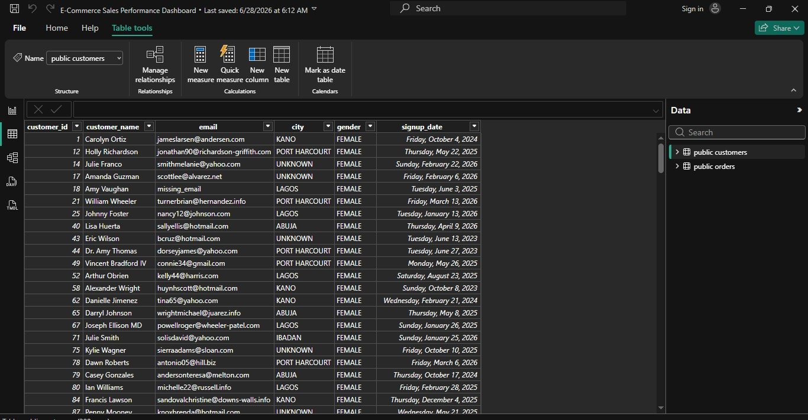
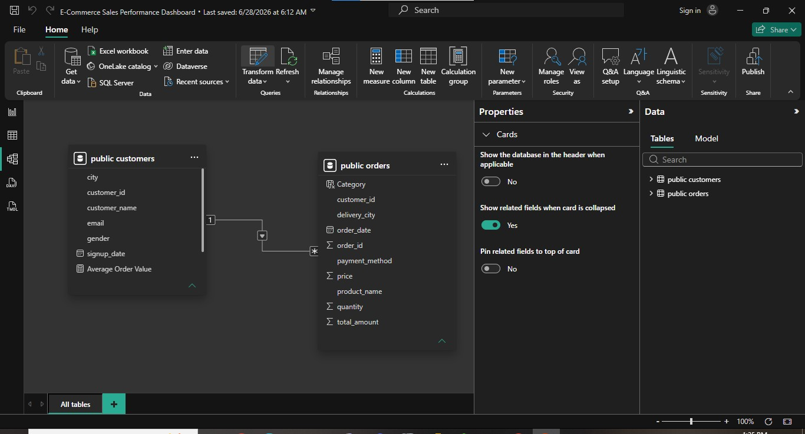

# E-Commerce Executive Sales Dashboard (Power BI)

An interactive Executive Sales Dashboard built in Power BI to monitor and evaluate e-commerce sales performance, combining data transformation, DAX measures, and visual analytics to support business decision-making.

## Project Overview

Management needed a dashboard to monitor business performance across revenue, orders, geography, product category, time, and payment method. This project takes the same e-commerce customer and order data (originally queried in PostgreSQL) into Power BI, cleans and models it, builds DAX measures for key KPIs, and visualizes the results in a single executive dashboard — backed by a written insight report and business recommendations.

**Tools used:** Power BI (Power Query, Data Modeling, DAX, Visualizations)

**Role framing:** Data Analyst

## The Data

- **Customers dataset:** `data/ecommerce_customers.csv` — customer records (customer_id, customer_name, email, city, gender, signup_date)
- **Orders dataset:** `data/ecommerce_orders.csv` — order records (order_id, customer_id, product_name, category, quantity, price, total_amount, payment_method, order_date, delivery_city)

Data was originally queried and validated in PostgreSQL, then imported into Power BI for cleaning, modeling, and visualization.

## Data Preparation

### Power Query — Cleaning & Transformation
Used Power Query to clean and validate the imported data before modeling, including handling missing/blank city values and standardizing fields for consistent grouping in visuals.

### Data Model
Built a relationship between the `customers` and `orders` tables (one-to-many on `customer_id`) to support cross-filtering between customer attributes and order-level metrics across the dashboard.

## DAX Measures

Key measures created to power the dashboard's KPI cards and visuals:
- **Total Revenue** — sum of order total amounts
- **Total Orders** — count of distinct orders
- **Average Order Value** — total revenue divided by total orders

## The Dashboard

The dashboard includes:
- **KPI cards:** Total Revenue (₦11.34M), Total Orders (200), Average Order Value (₦56.70K)
- **Total Revenue by City** — bar chart comparing Lagos, Kano, Ibadan, Abuja, Port Harcourt, and unknown/blank city records
- **Total Revenue by Category** — bar chart comparing Electronics vs. Accessories
- **Total Revenue by Month** — area/line chart showing revenue trend across the year
- **Total Revenue by Payment Method** — donut chart comparing PayPal, Cash, Card, and Transfer

## Key Insights

1. The company generated **₦11.34 million** in total revenue from **200 orders**, for an average order value of **₦56,700** — indicating strong overall sales performance and healthy customer spending.

2. **Lagos** is the company's highest-performing market by revenue. Kano, Ibadan, Abuja, Port Harcourt, and a set of blank/unknown city records trail behind, pointing to both market-expansion opportunity and a data-quality issue (missing location data) worth fixing.

3. **Electronics** accounts for roughly **58.4%** of total revenue vs. **41.6%** for Accessories, confirming Electronics as the company's primary revenue driver.

4. Monthly revenue fluctuated across the year, peaking in **February** with another rise in **August**, and dipping in **October** — suggesting seasonal purchasing patterns useful for inventory and promotional planning.

5. **PayPal** is the most-used payment method at **28.79%** of transactions (₦3.27M), followed by Cash (24.82%, ₦2.82M), Card (23.90%, ₦2.71M), and Transfer (22.49%, ₦2.55M) — a fairly balanced spread across channels, with PayPal slightly ahead.

## Business Recommendations

1. **Increase sales in underperforming cities.** Launch targeted digital marketing campaigns and location-specific promotions in cities with lower revenue, such as Kano and Ibadan, to grow customer acquisition and sales in those markets.

2. **Maximize revenue from high-performing categories.** Prioritize inventory for Electronics, introduce product bundles with Accessories, and offer cross-selling discounts at checkout to increase average order value.

3. **Leverage customer payment preferences and peak sales periods.** Maintain a seamless PayPal payment experience while running promotional campaigns ahead of high-performing months — particularly February and August — to maximize revenue during periods of increased customer demand.

## Skills Demonstrated

- Importing and connecting data from PostgreSQL into Power BI
- Data cleaning and transformation using Power Query
- Data modeling and building table relationships
- Writing DAX measures for core business KPIs
- Building an executive-level dashboard with multiple chart types (bar, line/area, donut, KPI cards)
- Translating dashboard findings into a written insight report and business recommendations
